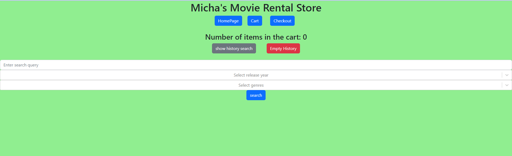

# Movie Rental strore

# Authors
* Name: Micha Briskman

# Technologies
* Client side - React, Node.js, IMDB API
* Server side - Java, Spring
* Server - Tomcat 9.0.73 
* Data Base - SQL

# About
This project is a Movie rental store.  
There are 3 main pages to the site: The homePage, The cartPage and the checkoutPage. 
When you first enter the site a form appears and lets you choose a movie by a search string, by a genre (select multi option), by release date (select option) 
and by genre and release date combined.  
The shopping cart is stored in the user session, using Spring session beans. 

 
Each item is presented with basic information (image, title, release date, price) and there is a fixed price of 3.99 for each item. 
 
  
 There is an ability to browse for more result pages.
 
The website records every search and build a history list of searches that allow the user to perform previous search in one click. 
The user is able to empty the search history at once.

 
After adding a movie to the cart a short message (modal) appears.

The search results allows adding movies to a shopping cart handled by the Spring server. 
The cart page allows to see all cart contents and the total cost of purchase.  
Each item is presented with basic information (image, title, release date, price) and there is a fixed price of 3.99 for each item.  
The page allows removing items one by one from the cart and emptying the cart at once.

 
The checkout page displays a form allowing customers to enter their information, and completes their purchase. 
Upon submission, the purchase is saved in the database, and the cart resets to be empty while returning to the home page.

There are navigation links/buttons between pages.

The database is a SQL database, where the id of the user that rents the movie is his email.
  

